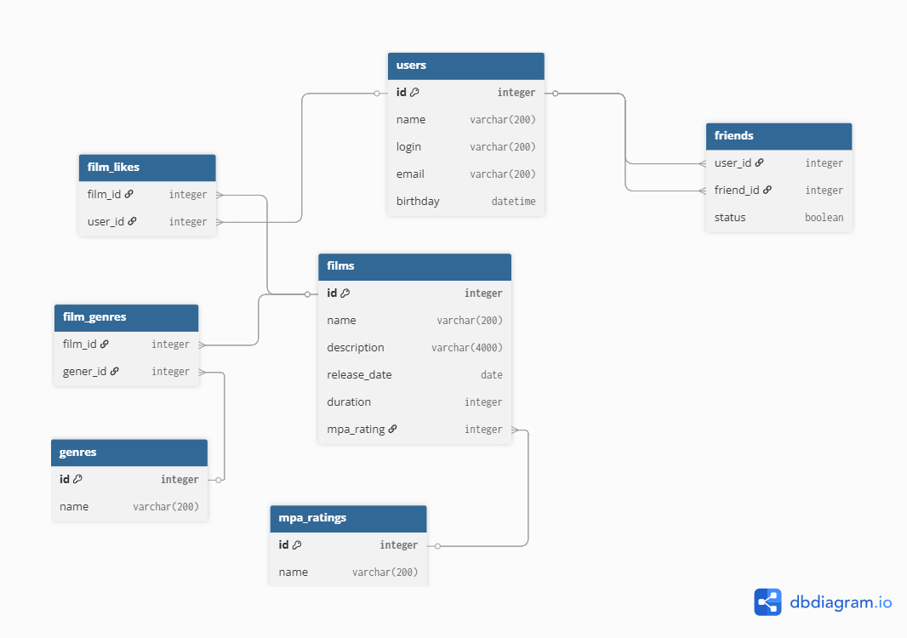

# Filmorate
Бэкенд для сервиса, который работает с фильмами и оценками пользователей, а также возвращает топ-10 фильмов,
рекомендованных к просмотру на основе лайков
___

## Функционал:

* добавление пользователей 
* просмотр списка всех пользователей
* обновление данных пользователя (логин, email, дата рождения)
* добавление в друзья с отслеживанием статуса дружбы, получение списка общих друзей  
* удаление из друзей
* добавление фильмов 
* просмотр списка всех фильмов
* обновление данных о фильмах (описание, рейтинг, жанры, дата релиза) 
* добавление/удаление лайков фильмам 
* просмотр списка топ 10 самых популярных фильмов

### Структура базы данных в ER диаграмме

---

